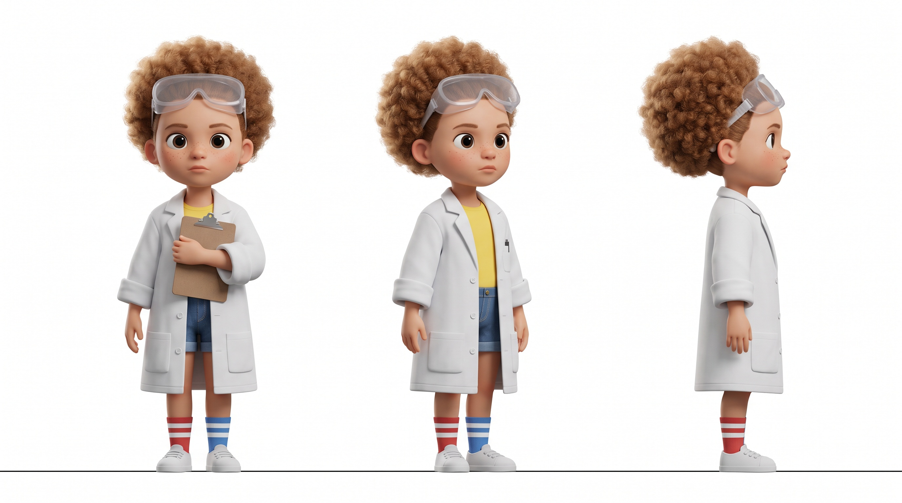
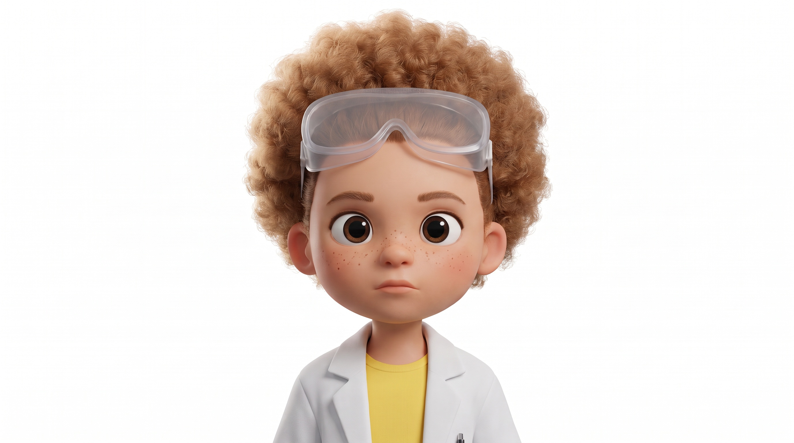

# Day 4: Characters Who Act

*An eight-year-old scientist in a lab coat runs a formal taste test of her lemonade on her grandfather, and the verdict is a Nobel Prize.*

Watch: https://cxbxmxcx.github.io/learn-ai-filmmaking/day-4-characters-who-act/

## The generation prompt

Model endpoint on fal: `bytedance/seedance-2.5/reference-to-video`. Seed returned: `1832639636`.

```
Settings
Model: Seedance 2.5, text-to-video with reference images
References: @Image1 the Penny character sheet, @Image2 the Penny close-up
Duration: 25 seconds
Aspect ratio: 16:9
Resolution: 720p
Audio: on
Seed: any (write it down if you like the result)

Prompt
@Image1 and @Image2 are Penny, an eight-year-old girl with light brown curly hair in a round puff, freckles, big dark eyes, an oversized white lab coat over a yellow t-shirt, clear safety goggles pushed up into her hair, and mismatched striped socks. In a sunlit kitchen, Penny runs a deadly serious taste test of her lemonade on her grandfather Gus, a big man in a brown cardigan with reading glasses on a cord and a thick grey mustache, who sips it, deliberates like a judge, and delivers his verdict.

Look: 35mm, shallow depth of field, 24 fps, fine 35mm film grain, soft morning window light, warm and softly contrasted, natural skin tones, a real family kitchen with a wooden table, not a commercial.

[0 to 6 seconds] Locked-off two-shot, eye level, Penny on the left standing on a kitchen chair, Gus seated on the right with his hands flat on the table. Penny pours cloudy lemonade from a glass beaker into a tumbler, slides it across the table with two fingers, clicks her pen over a clipboard, and says, clinical and flat: "Sample seven. Describe the flavor profile." She does not blink. Gus watches the glass, wary.
[6 to 14 seconds] The camera drifts slowly to favor Gus, keeping Penny in frame. He lifts the tumbler, sniffs it like a wine judge, sips, and deliberates: eyes to the ceiling, a slow chew of nothing, a long pause, one eyebrow rising. Penny holds the pen ready above the clipboard and does not move.
[14 to 20 seconds] Gus sets the glass down with ceremony, folds his hands on the table, looks Penny in the eye, and says, grave and slow: "Nobel Prize."
[20 to 25 seconds] Penny nods once, writes on the clipboard without a flicker of a smile, then makes a tiny fist pump below the edge of the table. Gus hides a grin behind his mustache. The camera settles back to the two-shot and holds.

Audio: lemonade pouring into glass, the click of a pen, a wooden chair creaking, birds outside the window. Penny's voice is small, precise and serious; Gus's voice is low and warm with a gravelly edge. Only the two quoted lines are spoken. No music.

Constraints: one continuous shot with no cuts, exactly two people, Penny's face, hair, goggles, coat and socks must match @Image1 and @Image2 exactly, do not alter her facial proportions, no identity drift, Penny never smiles, no readable text on the clipboard, only the two quoted lines of dialogue, no extra limbs, no jitter.
```

## Reference image prompts (Nano Banana Pro)

### @Image1: the character sheet

```
Character turnaround reference sheet in the style of a modern 3D animated feature film, a stylized cartoon character with softly exaggerated proportions and not a photograph, 16:9, plain pure white background. The same eight-year-old girl shown three times side by side at the same scale, feet on the same baseline, evenly spaced: a front view on the left, a three-quarter view in the middle, a right profile on the right. Full body from head to feet in every view, standing relaxed, arms at her sides except in the front view where she holds a clipboard against her chest, and a neutral, serious expression in all three. Penny: light brown curly hair in a round puff, a round face, freckles across her nose, big dark eyes. She wears an oversized white lab coat with the sleeves rolled twice over a yellow t-shirt, clear safety goggles pushed up into her hair, denim shorts, one red-and-white striped sock and one blue-and-white striped sock, and white sneakers. The three figures are identical in face, hair, clothing and proportions. Soft, even studio light, no cast shadows on the background, no text, no labels, no borders, no props other than the clipboard.
```



### @Image2: the close-up

```
Using the attached character sheet as the reference for her face, a close-up portrait in the same stylized 3D animated style, 16:9, of the same eight-year-old girl, Penny, front-facing and centered, framed from the collar up: light brown curly hair in a round puff, freckles across her nose, big dark eyes, clear safety goggles pushed up into her hair, the collar of an oversized white lab coat over a yellow t-shirt. A neutral, deadly serious expression, plain pure white background, soft even light, sharp focus on the eyes, no text, no labels.
```



## Infographic prompts (Nano Banana Pro, 16:9, 2K)

### Figure 4.1: What makes a character readable on screen, before a single frame is generated.

```
Flat, clean educational infographic, 16:9, off-white background (#F4F8FB). Bold all-caps navy title "A CHARACTER YOU CAN READ" with a lighter mixed-case subtitle "Five things the audience learns before anyone speaks". Layout: a centered simple black line drawing of a small girl in an oversized lab coat with goggles pushed up in curly hair, holding a clipboard, drawn as a clean silhouette-style figure. Around her, five rounded pastel cards with teal arrows pointing to the relevant part of the figure. Light blue "SILHOUETTE" pointing to her outline, body "Oversized coat, round hair puff. Recognizable as a shape." Mint "ONE MARK" pointing to the goggles, body "Safety goggles pushed up. The thing no one else has." Peach "WARDROBE TELLS THE JOB" pointing to the coat, body "Lab coat over a yellow t-shirt says scientist, says kid." Lavender "MOVEMENT STYLE" pointing to her stance, body "Precise, still, clinical. Never fidgets." Rose "VOICE" pointing to her mouth, body "Small, flat, serious. Never giggles." Beneath the figure, a small light grey card reads "Write these five lines once. They become the character header in every prompt." Full-width teal banner across the bottom reading "KEY INSIGHT: Consistency starts with design. A vague character cannot be kept consistent because there is nothing to keep." in white. Legible sans-serif type, thin matching borders, no gradients, no 3D, no photographic textures.
```

### Figure 4.2: Anatomy of a character sheet. What it must contain, and why each part matters.

```
Flat, clean educational infographic, 16:9, off-white background (#F4F8FB). Bold all-caps navy title "ANATOMY OF A CHARACTER SHEET" with a lighter mixed-case subtitle "The reference the model can hold". Layout: in the center, one large rounded frame with a white interior containing a simple black line drawing of the same small girl in a lab coat shown three times side by side, full body, labelled beneath each figure "FRONT", "THREE-QUARTER", "PROFILE". Four rounded pastel cards at the corners with teal arrows pointing into the frame. Top left, light blue "THREE VIEWS": body "Front, three-quarter, profile. The model needs the turn, not just the face." Top right, peach "FULL BODY": body "Head to feet. Wardrobe and proportions are identity too." Bottom left, mint "NEUTRAL BACKGROUND": body "Plain white, even light, no cast shadows. Nothing to confuse with the character." Bottom right, rose "PLAIN CLOTHING WORDS": body "Describe the coat simply so the face stays the subject." Beneath the frame, a small light grey card with a small square icon reads "PLUS ONE CLOSE-UP: a front-facing portrait of the same face, generated from the sheet, for the second reference slot." Full-width teal banner across the bottom reading "KEY INSIGHT: One sheet and one close-up is enough for a whole film. Make them once, reuse them everywhere." in white. Legible sans-serif type, thin matching borders, no gradients, no 3D, no photographic textures.
```

Correction appended for the published take:

```
Character consistency matters here: the girl drawn in all three views and in the small close-up inset is the same character, Penny: a big round puff of curly hair with safety goggles pushed up into it, a round face with freckles, an oversized lab coat with the sleeves rolled, shorts, and one striped sock different from the other. Do not draw straight or bobbed hair.
```

### Figure 4.3: The identity anchor. What drifts without it, and the three lines that hold it.

```
Flat, clean educational infographic, 16:9, off-white background (#F4F8FB). Bold all-caps navy title "THE IDENTITY ANCHOR" with a lighter mixed-case subtitle "References only work when you tell the model what they are for". Layout: left half, a rose card titled "WITHOUT AN ANCHOR" containing four small line icons in a column with captions: a face with an arrow to an older face "AGE DRIFTS", curly hair to straight hair "HAIR DRIFTS", goggles fading out "PROPS VANISH", a coat becoming a jacket "WARDROBE CHANGES". Right half, a mint card titled "WITH AN ANCHOR" containing three stacked light grey text cards: "LINE 1: '@Image1 and @Image2 are Penny.'", "LINE 2: 'Penny's face, hair, goggles and coat must match the references exactly.'", "LINE 3: 'Do not alter facial proportions. No identity drift.'" Between the halves, a teal arrow pointing right labelled "NAME THE JOB". Beneath both halves, a wide light blue card reads "Two to four angles of the same face hold better than one perfect portrait." Full-width teal banner across the bottom reading "KEY INSIGHT: An unassigned reference is a suggestion. An assigned reference is a contract." in white. Legible sans-serif type, thin matching borders, no gradients, no 3D, no photographic textures.
```

### Figure 4.4: Anatomy of a timeline prompt. Four beats, each with a face, a hand and a voice.

```
Flat, clean educational infographic, 16:9, off-white background (#F4F8FB). Bold all-caps navy title "ANATOMY OF A TIMELINE PROMPT" with a lighter mixed-case subtitle "Beats, not moods. Four of them in twenty-five seconds." Layout: a horizontal timeline bar across the upper middle from 0 to 25 seconds divided into four colored segments labelled above: light blue "0 to 6 s PRESENT", peach "6 to 14 s TASTE", lavender "14 to 20 s VERDICT", mint "20 to 25 s REACT". Beneath each segment, a rounded card of the same color with three short lines prefixed by small black line icons of a face, a hand and a speech bubble. Segment 1: "Face: unblinking", "Hands: pours, slides glass, clicks pen", "Voice: 'Sample seven. Describe the flavor profile.'" Segment 2: "Face: eyes to ceiling, one eyebrow", "Hands: lifts, sniffs, sips", "Voice: silence, a long pause". Segment 3: "Face: grave, judicial", "Hands: sets glass down, folds hands", "Voice: 'Nobel Prize.'" Segment 4: "Face: no smile, then a grin hidden by a mustache", "Hands: writes, tiny fist pump", "Voice: none". At the far right of the timeline a small rose card reads "THE TURN: the child is the authority". Full-width teal banner across the bottom reading "KEY INSIGHT: Write what the face, the hands and the voice do in each window. A mood is not a direction." in white. Legible sans-serif type, thin matching borders, no gradients, no 3D, no photographic textures.
```

### Figure 4.5: Dialogue rules. Five habits that make generated speech land.

```
Flat, clean educational infographic, 16:9, off-white background (#F4F8FB). Bold all-caps navy title "DIALOGUE RULES" with a lighter mixed-case subtitle "Five habits that make generated speech land". Layout: five rounded pastel cards in a row, each with a black line icon and a short example beneath the rule. Light blue "QUOTE IT" icon of quotation marks, body "Put the exact words in double quotes. The model speaks what is quoted and nothing else." Mint "NAME THE SPEAKER" icon of a name tag, body "Penny says, not she says. Pronouns lose the speaker." Peach "BIND IT TO AN ACTION" icon of a hand, body "'She clicks her pen and says...' The action carries the timing." Lavender "GIVE IT A TONE" icon of a musical note, body "Clinical and flat. Grave and slow. One or two words." Rose "KEEP IT SHORT" icon of a ruler, body "About a dozen words per eight seconds. One exchange per window." Beneath the row, a wide light grey card reads "Example: Penny clicks her pen over the clipboard and says, clinical and flat: 'Sample seven. Describe the flavor profile.'" Full-width teal banner across the bottom reading "KEY INSIGHT: A line of dialogue is an action with words in it. Direct the action and the words follow." in white. Legible sans-serif type, thin matching borders, no gradients, no 3D, no photographic textures.
```

Correction appended for the published take:

```
The short example under each rule must be exactly one of these lines from the film, and must never use a pronoun such as he or she as the speaker. Card 1 example: Penny says: "Sample seven." Card 2 example: Gus says: "Nobel Prize." Card 3 example: Penny clicks her pen and says: "Sample seven." Card 4 example: Gus says, grave and slow: "Nobel Prize." Card 5 example: "Nobel Prize." Two words. Do not invent any other dialogue.
```

### Figure 4.6: The performance ladder. Three ways to make a character act, and what each one adds.

```
Flat, clean educational infographic, 16:9, off-white background (#F4F8FB). Bold all-caps navy title "THE PERFORMANCE LADDER" with a lighter mixed-case subtitle "Three ways to make a character act". Layout: three rounded pastel cards arranged as ascending steps from left to right, joined by teal arrows, each with a black line icon. Step 1, light blue, icon of a text document: "PROMPT ONLY" body "Beats, micro-actions and tone in words. Fast, cheap, identity changes every take." Step 2, peach, with a thicker border and a small teal tag "THIS ARTICLE", icon of a portrait photo: "PROMPT PLUS REFERENCES" body "The sheet and the close-up lock identity; the beats direct the acting; the frame stays free." Step 3, mint, icon of a phone on a tripod: "CAPTURED PERFORMANCE" body "Act the beat yourself on a phone and transfer it to the character. Exact timing and expression." Beneath the steps, a wide light grey card reads "Start on step two. Climb to step three only when a beat is too subtle for words." Full-width teal banner across the bottom reading "KEY INSIGHT: References buy identity. Beats buy performance. You need both before capture is worth the trouble." in white. Legible sans-serif type, thin matching borders, no gradients, no 3D, no photographic textures.
```
