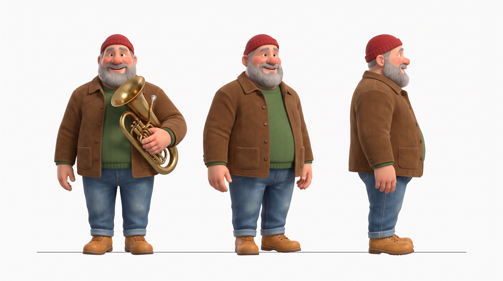
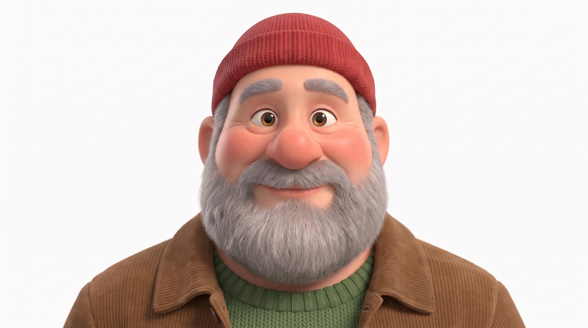

# Day 7: The Director's Prompt

*A tuba busker on a subway platform plays to commuters who ignore him until a toddler starts dancing, and by the time the train arrives the whole platform is dancing with her.*

Watch: https://cxbxmxcx.github.io/learn-ai-filmmaking/day-7-the-directors-prompt/

## The generation prompt

Model endpoint on fal: `bytedance/seedance-2.5/reference-to-video`. Seed returned: `481698027`.

```
Settings
Model: Seedance 2.5, text-to-video with reference images
References: @Image1 the Moe character sheet, @Image2 the Moe close-up
Duration: 30 seconds
Aspect ratio: 16:9
Resolution: 720p
Audio: on
Seed: any (write it down if you like the result)

Prompt
@Image1 and @Image2 are Moe, a round, cheerful busker in his fifties with a full grey beard, ruddy cheeks, a red knit beanie, and a brown corduroy jacket over a green sweater, who plays a brass tuba. On an evening subway platform, Moe plays a bouncy tuba melody to commuters who ignore him until a toddler in a yellow puffy jacket starts dancing, and by the time the train pulls in the whole platform is dancing with her.

Look: 35mm, 24 fps, handheld with a gentle documentary sway, cool fluorescent platform light with a warm bounce off the tuba's brass, fine 35mm film grain, muted realistic colors, a real city subway at evening rush hour, not a commercial.

[0 to 5 seconds] Wide shot down the platform. Moe plays beside a tiled pillar with his tuba case open at his feet, bouncing gently on his heels. A dozen commuters stand in a line along the platform edge staring at their phones. Nobody looks up.
[5 to 9 seconds] Hard cut. Medium shot. A toddler in a yellow puffy jacket lets go of her mother's hand and starts bouncing to the beat, knees pumping, arms up. Her mother reaches for her, mortified, and says: "Sorry!" Moe, between phrases and still playing, says warmly: "Don't be."
[9 to 14 seconds] Hard cut. Close-up on Moe: cheeks puffing, eyes crinkling, he leans into the toddler's rhythm and plays faster and brighter.
[14 to 20 seconds] Hard cut. Wide shot. One commuter's foot taps. A woman sways. A man in a suit does a small, careful shuffle. A nurse in scrubs claps on the beat. Within seconds the whole platform is moving, phones forgotten.
[20 to 26 seconds] Hard cut. Wide shot as the train roars in from the right, its wind lifting scarves and the toddler's hair; the fluorescent lights along the platform begin to pulse in time with the music; the doors slide open to reveal a carriage full of passengers already dancing.
[26 to 30 seconds] Hard cut. Wide shot. Everyone boards still dancing; the toddler waves at Moe from the doorway; Moe plays the last note and lifts the tuba in salute as the doors close; the lights hold bright.

Audio: a bouncy, joyful tuba melody carrying through every shot, platform echo, a distant train rumble growing into a roar and the hiss of doors, the toddler giggling, shoes scuffing on concrete, a chorus of laughter and claps at the end. Moe's voice is low, gravelly and kind; the mother's voice is light and flustered. Only the two quoted lines are spoken. No other music.

Constraints: six shots with hard cuts only at the listed times, no dissolves and no fades, Moe's face, beard, beanie, jacket and tuba must match @Image1 and @Image2 exactly, do not alter his facial proportions, no identity drift, one toddler and one mother in focus with other commuters in the background only, only the two quoted lines of dialogue, no readable text or signage, the lights must not pulse before the train arrives, no extra limbs, no jitter.
```

## Reference image prompts (Nano Banana Pro)

### @Image1: the character sheet

```
Character turnaround reference sheet in the style of a modern 3D animated feature film, a stylized cartoon character with softly exaggerated proportions and not a photograph, 16:9, plain pure white background. The same man shown three times side by side at the same scale, feet on the same baseline, evenly spaced: a front view on the left, a three-quarter view in the middle, a right profile on the right. Full body from head to feet in every view, standing relaxed with a friendly, neutral expression; in the front view he holds a brass tuba resting against his hip, and in the other two views his arms are at his sides. Moe: a round, cheerful busker in his fifties with a full grey beard and ruddy cheeks, a red knit beanie, a brown corduroy jacket over a green sweater, worn blue jeans and tan leather boots. The three figures are identical in face, beard, clothing and proportions. Soft, even studio light, no cast shadows on the background, no text, no labels, no borders, no props other than the tuba.
```



### @Image2: the close-up

```
Using the attached character sheet as the reference for his face, a close-up portrait in the same stylized 3D animated style, 16:9, of the same man, Moe, front-facing and centered, framed from the collar up: a full grey beard, ruddy cheeks, warm eyes with laugh lines, a red knit beanie, the collar of a brown corduroy jacket over a green sweater. A friendly, neutral expression, plain pure white background, soft even light, sharp focus on the eyes, no text, no labels.
```



## Infographic prompts (Nano Banana Pro, 16:9, 2K)

### Figure 7.1: The whole pipeline on one page. Every article's technique, in the order you use them.

```
Flat, clean educational infographic, 16:9, off-white background (#F4F8FB). Bold all-caps navy title "THE WHOLE PIPELINE ON ONE PAGE" with a lighter mixed-case subtitle "Seven articles, one order of operations". Layout: eight rounded pastel cards in a flowing left-to-right path across two rows, joined by teal arrows, each with a small black line icon and the article it came from in a tiny navy tag. Row 1: light blue "LOGLINE AND BEATS" tag "Article 1", body "A person, a want, an obstacle, a turn"; mint "CHARACTER AND REFERENCES" tag "Article 4", body "Five readable lines, one sheet, one close-up"; peach "LOOK HEADER" tag "Article 2", body "Camera package, grade, lighting per state"; lavender "SHOT TABLE" tag "Articles 3 and 5", body "Coverage, moves, durations, cuts". Row 2: rose "SOUND PLAN" tag "Article 5", body "Dialogue, Foley, ambience, score, one bridge"; light teal "THE EFFECT" tag "Article 6", body "Cause, peak, aftermath, pillars"; light grey "THE PROMPT" tag "Article 7", body "References, subject, look, windows, audio, constraints"; navy-bordered light blue "GENERATE AND JUDGE" tag "Every article", body "One take, judged against the table". A thin navy bracket under the whole path labelled "ALL ON PAPER BEFORE A SINGLE CREDIT IS SPENT". Full-width teal banner across the bottom reading "KEY INSIGHT: The film is made on paper. The generation only prints it." in white. Legible sans-serif type, thin matching borders, no gradients, no 3D, no photographic textures.
```

### Figure 7.2: The shot table. The internal schema that every prompt in this series was rendered from.

```
Flat, clean educational infographic, 16:9, off-white background (#F4F8FB). Bold all-caps navy title "THE SHOT TABLE" with a lighter mixed-case subtitle "The film in a form you can argue with". Layout: a single wide light grey rounded card containing a clean table drawn with thin navy lines, six rows and seven columns. Column headers in all caps: "SHOT", "WINDOW", "SIZE AND CAMERA", "ACTION", "DIALOGUE", "SOUND", "CUT IN". Rows: "1" "0 to 5 s" "Wide, handheld sway" "Moe plays beside a pillar; commuters stare at phones" "none" "tuba melody, platform echo" "open"; "2" "5 to 9 s" "Medium" "Toddler in a yellow jacket breaks free and bounces to the beat" "Mother: Sorry! Moe: Don't be." "tuba, a giggle" "hard cut"; "3" "9 to 14 s" "Close-up on Moe" "Cheeks puff, eyes crinkle, he plays faster" "none" "tuba brighter" "hard cut"; "4" "14 to 20 s" "Wide" "A foot taps, a woman sways, a suit shuffles, a nurse claps; the platform moves" "none" "tuba, shoes on concrete" "hard cut"; "5" "20 to 26 s" "Wide, train enters right" "Wind lifts scarves; the lights pulse to the beat; doors open on dancing passengers" "none" "train roar, door hiss, tuba" "hard cut"; "6" "26 to 30 s" "Wide" "Everyone boards dancing; toddler waves; last note; tuba raised" "none" "last note, laughter, claps" "hard cut". Each row's first cell is tinted alternately light blue and mint. Beneath the table, a small navy note reads "Durations: 5, 4, 5, 6, 6, 4. A build, then a release." Full-width teal banner across the bottom reading "KEY INSIGHT: Fix the table, not the generation. A row costs nothing; a take costs money." in white. Legible sans-serif type, thin matching borders, no gradients, no 3D, no photographic textures.
```

### Figure 7.3: The prompt bible header. Characters, look and audio design, written once and reused.

```
Flat, clean educational infographic, 16:9, off-white background (#F4F8FB). Bold all-caps navy title "THE PROMPT BIBLE HEADER" with a lighter mixed-case subtitle "Three blocks of constants that keep a film together". Layout: three stacked wide rounded cards in the center like the top of a document. Card 1, lavender, label "CHARACTERS": text "Moe: round busker, grey beard, red beanie, corduroy jacket, tuba; bouncy, unhurried; voice low, gravelly, kind. Toddler: yellow puffy jacket, fearless. Mother: mortified." Card 2, peach, label "LOOK": text "35mm, handheld sway, cool fluorescent platform light with warm brass bounce, fine grain, muted real colors, evening rush hour, not a commercial." Card 3, mint, label "AUDIO DESIGN": text "A bouncy tuba melody in every shot, platform echo, train rumble rising to a roar, no other music." To the left, a small light blue card with an arrow into the stack reads "WRITTEN ONCE". To the right, a small rose card with an arrow out reads "EVERY WINDOW INHERITS IT". Beneath the stack, a light grey card reads "In a series, the header travels between films. In a film, it travels between prompts." Full-width teal banner across the bottom reading "KEY INSIGHT: Constants go in the header. Only what changes goes in the windows." in white. Legible sans-serif type, thin matching borders, no gradients, no 3D, no photographic textures.
```

### Figure 7.4: Anatomy of the director's prompt. Every layer has one place to live.

```
Flat, clean educational infographic, 16:9, off-white background (#F4F8FB). Bold all-caps navy title "ANATOMY OF THE DIRECTOR'S PROMPT" with a lighter mixed-case subtitle "Every layer has one place to live". Layout: a tall light grey rounded card in the center styled like a document, containing seven stacked horizontal bands top to bottom, each with a label on the left and a short sample on the right: lavender "REFERENCES" "@Image1 and @Image2 are Moe..."; light blue "SUBJECT AND ACTION" "a busker plays to commuters who ignore him until a toddler dances..."; peach "LOOK HEADER" "35mm, handheld sway, fluorescent light, fine grain..."; mint "TIME WINDOWS" "[0 to 5 seconds] Wide shot down the platform..."; rose "DIALOGUE INSIDE A WINDOW" "her mother says: 'Sorry!'"; light teal "AUDIO" "a bouncy tuba melody, platform echo, train roar..."; light grey "CONSTRAINTS" "six shots, hard cuts, match the references, only two lines...". To the right of the document, six small navy tags with teal arrows pointing at the bands: "IDENTITY" at references, "STORY" at subject, "CONSISTENCY" at look, "TIME AND CUTS" at windows, "PERFORMANCE" at dialogue, "RULES" at constraints. Full-width teal banner across the bottom reading "KEY INSIGHT: When two layers disagree, the model picks one. Make sure they never disagree." in white. Legible sans-serif type, thin matching borders, no gradients, no 3D, no photographic textures.
```

### Figure 7.5: The pre-generation checklist. Two minutes that save a take.

```
Flat, clean educational infographic, 16:9, off-white background (#F4F8FB). Bold all-caps navy title "THE PRE-GENERATION CHECKLIST" with a lighter mixed-case subtitle "Two minutes that save a take". Layout: a single tall light grey rounded card containing ten checklist rows, each with a small navy check box icon on the left and text on the right, alternately tinted light blue and mint: "Every reference is named and given a job"; "The first sentence has the subject and the action, nothing else"; "The look header appears once and is never contradicted"; "Every window opens with its cut or its camera"; "Durations add up to the clip length and read as a rhythm"; "Every quoted line is under a dozen words and bound to an action"; "Every sound the audience should hear is named; the ones they should not are named"; "The effect has a visible cause, a peak and a residue"; "Nothing is hidden by accident: what must not be seen early is in the constraints"; "No fact is stated twice with two values". Beneath the card, a small rose card reads "Any unchecked box: fix the table, not the prompt." Full-width teal banner across the bottom reading "KEY INSIGHT: The take you cannot afford to reroll is the take you check twice." in white. Legible sans-serif type, thin matching borders, no gradients, no 3D, no photographic textures.
```

### Figure 7.6: After the generation. Post, provenance and release, in the order that works.

```
Flat, clean educational infographic, 16:9, off-white background (#F4F8FB). Bold all-caps navy title "AFTER THE GENERATION" with a lighter mixed-case subtitle "A take is not a film. The order that works." Layout: two rows. Top row, six rounded pastel cards joined by teal arrows with black line icons: light blue "ASSESS" icon of an eye, "Full size, headphones, log every flaw"; mint "REMEDIATE" icon of a wrench, "Small edits first, regenerate last"; peach "UPSCALE" icon of expanding arrows, "Once, after fixes, before color"; lavender "GRADE" icon of a color wheel, "One look, matched across shots"; rose "MIX" icon of a waveform, "Dialogue forward, loudness to spec"; light teal "FINISH" icon of a clapperboard, "Titles, credits, masters per platform". Bottom row, three wider rounded cards: light grey "PROVENANCE" icon of a shield, "AI-content toggle on the platform, a credit line, content credentials where supported. In 2026 disclosure is part of delivery."; light grey "RELEASE ORDER" icon of a funnel, "Festivals that require premieres first, curated showcases next, open platforms last."; light grey "KEEP" icon of a folder, "Export every take at full quality and keep prompts and references outside the tool." Full-width teal banner across the bottom reading "KEY INSIGHT: Generation is the beginning of post, not the end of it." in white. Legible sans-serif type, thin matching borders, no gradients, no 3D, no photographic textures.
```
